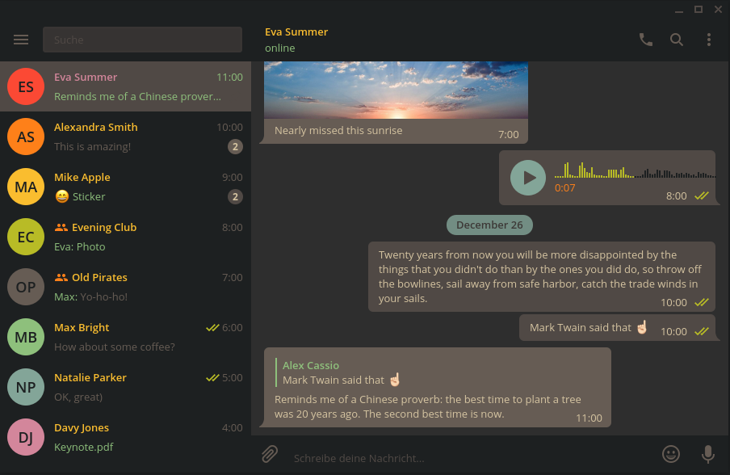
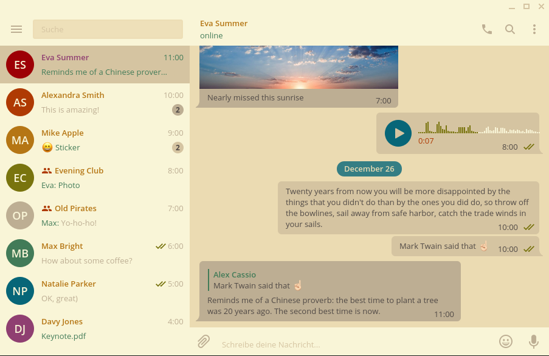
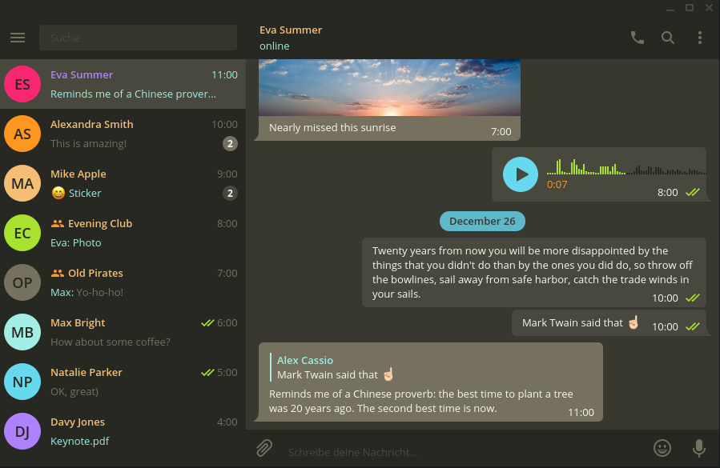
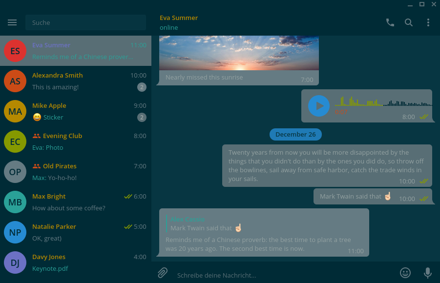
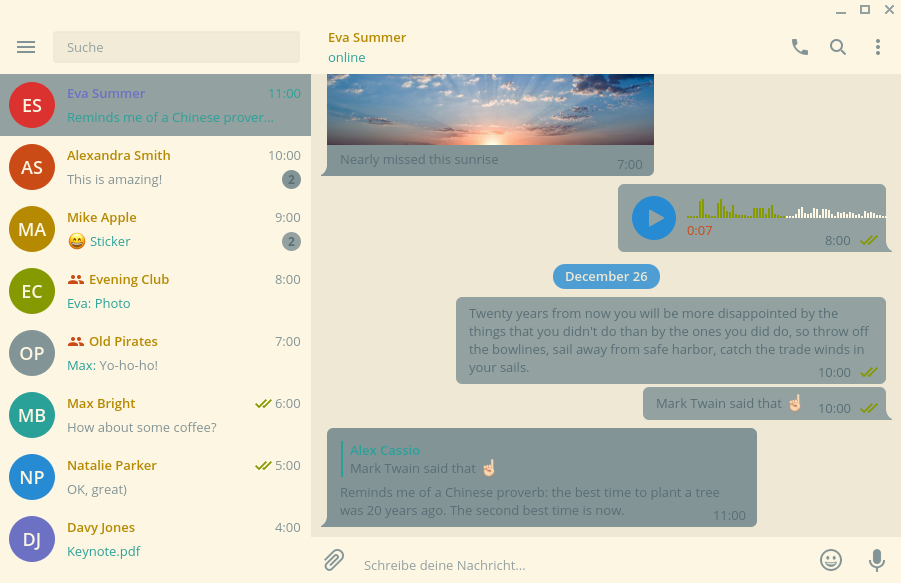

# base16-telegram-desktop
([Deutsch](doc/README_DE.md))

This repository is meant to work with
[base16](https://github.com/chriskempson/base16).
It provides a simple template for [Telegram Desktop](https://desktop.telegram.org).

The themes have been built using [base16-builder-python](https://github.com/InspectorMustache/base16-builder-python).

## Usage
Download your favourite theme from `themes/YOUR-THEME/YOUR-THEME.tdesktop-theme` and set it from `telegram-desktop` in Settings/Chat background/Choose from file and browse to the file `YOUR-THEME.tdesktop-theme`

## Contributors
- [Neil Smith](https://github.com/dracula/telegram/blob/master/colors.tdesktop-theme) (Dracula Theme v0.1)

## Screenshots

### gruvbox-dark-hard

### gruvbox-light-hard

### molokai

### solarized-dark

### solarized-light

